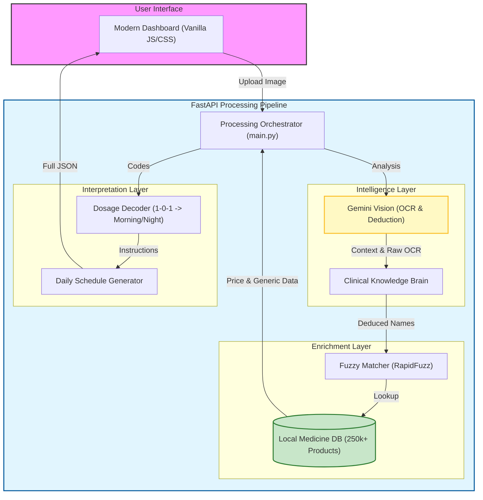

# Pharm-X

A simple web app that pulls the messy handwriting off doctor's prescriptions and turns it into clean, readable text. 

It tells you what the medicines are for, catches dosage instructions (like "1-0-1" -> "Morning and Night"), flags how to take them with food, and gives you a nice daily schedule layout.

## How it works

1. You upload an image of a prescription.
2. The backend sends the image to Google's Gemini Vision model to read the messy handwriting and extract the raw list of medicines.
3. It takes those guessed medicine names and cross-checks them against a massive local database of 250,000+ Indian medicines.
4. It fixes any typos the AI made, pulls the real generic names and prices, and decodes the doctor's shorthand into plain English.
5. The frontend displays everything in a clean dashboard.

## System Architecture

Pharm-X uses a multi-layered pipeline to transform messy handwriting into structured clinical data.



### Key Components

*   **AI OCR Layer**: Uses Gemini 2.5 Flash Lite to not just read characters, but use medical context to deduce what a doctor *meant* to write when the handwriting is ambiguous.
*   **Knowledge Augmentation**: A local database provides ground-truth pricing, generic salt information, and manufacturer details that aren't usually on the paper.
*   **Clinical Logic**: Interprets doctor shorthand (like `SOS`, `BD`, `HS`) into friendly instructions for the patient.

## Tech Stack

- **Backend:** Python, FastAPI, Uvicorn
- **Data Matching:** Pandas, RapidFuzz
- **OCR/Vision:** Google Generative AI (Gemini Flash Lite)
- **Frontend:** Plain HTML, CSS, Vanilla JavaScript

## Setup & Running Locally

You'll need Python installed on your computer.

1. **Clone the repo**
   ```bash
   git clone https://github.com/late-cat/pharm-x.git
   cd pharm-x
   ```

2. **Set up a virtual environment**
   ```bash
   python -m venv venv
   source venv/bin/activate  # On Windows use: venv\Scripts\activate
   ```

3. **Install dependencies**
   ```bash
   pip install -r requirements.txt
   ```

4. **Add your API Key**
   - Head over to [Google AI Studio](https://aistudio.google.com/) and grab a free API key.
   - Create a `.env` file in the root folder.
   - Add this single line to the file:
     ```
     GEMINI_API_KEY=your_actual_key_here
     ```

5. **Run the app**
   ```bash
   cd backend
   python main.py
   ```

6. Open your browser and go to `http://localhost:8000`. You're good to go.
